# Тест-кейсы для TodoApp

## Общая информация

| Параметр | Значение |
|----------|----------|
| Приложение | TodoApp Console Application |
| Версия | 2.0 (EF Core + SQLite) |
| Дата тестирования | 2026-04-04 |
| Тестировщик | Сербин Данил |

---

## 1. Пользователи и авторизация

### TC-01 Создание нового пользователя

**Описание:** Проверка корректного создания нового пользователя в системе.

**Предусловия:** Приложение запущено. Пользователь не авторизован.

**Последовательность действий:**
1. Запустить приложение (`dotnet run`)
2. На вопрос "Войти в существующий профиль? [y/n]" ввести `n`
3. Ввести логин: `testuser1`
4. Ввести пароль: `password123`
5. Ввести имя: `Тестовый`
6. Ввести фамилию: `Пользователь`
7. Ввести год рождения: `2000`

**Ожидаемый результат:**
- Пользователь `testuser1` успешно создан
- Появляется приветствие: `Добро пожаловать, Тестовый!`
- Пользователь сохранён в базе данных `todos.db`

**Скриншоты:**

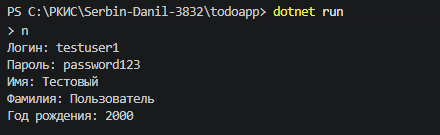

---

### TC-02 Авторизация пользователя

**Описание:** Проверка входа в существующий профиль.

**Предусловия:** Приложение запущено. Пользователь не авторизован. Пользователь `testuser1` существует.

**Последовательность действий:**
1. Запустить приложение
2. На вопрос "Войти в существующий профиль? [y/n]" ввести `y`
3. Ввести логин: `testuser1`
4. Ввести пароль: `password123`

**Ожидаемый результат:**
- Выполнен вход в профиль
- Появляется приветствие: `Добро пожаловать, Тестовый!`

**Скриншоты:**

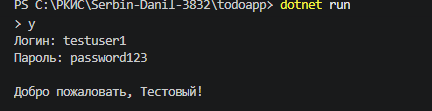

---

### TC-03 Ошибка авторизации (неверный пароль)

**Описание:** Проверка обработки неверного пароля.

**Предусловия:** Приложение запущено. Пользователь `testuser1` существует.

**Последовательность действий:**
1. Запустить приложение
2. На вопрос "Войти в существующий профиль? [y/n]" ввести `y`
3. Ввести логин: `testuser1`
4. Ввести пароль: `wrongpassword`

**Ожидаемый результат:**
- Сообщение: `Неверный пароль. Осталось попыток: 2`
- Вход не выполнен

**Скриншоты:**

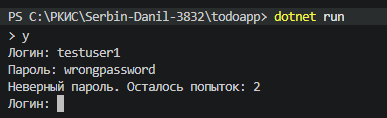

---

### TC-04 Выход из текущего пользователя

**Описание:** Проверка выхода из профиля.

**Предусловия:** Пользователь авторизован.

**Последовательность действий:**
1. Ввести команду `profile -o`

**Ожидаемый результат:**
- Сообщение: `Вы вышли из профиля`
- Появляется меню авторизации

**Скриншоты:**

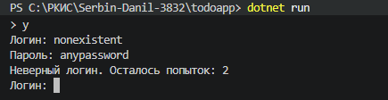

---

## 2. Добавление задач (add)

### TC-05 Добавление задачи с корректными данными

**Описание:** Проверка добавления обычной задачи.

**Предусловия:** Пользователь авторизован.

**Последовательность действий:**
1. Ввести команду `add "Купить молоко"`

**Ожидаемый результат:**
- Сообщение: `Задача добавлена: Купить молоко`
- Задача сохраняется в БД

**Скриншоты:**

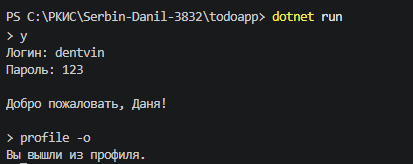

---

### TC-06 Добавление задачи с пустым названием

**Описание:** Проверка обработки пустого названия задачи.

**Предусловия:** Пользователь авторизован.

**Последовательность действий:**
1. Ввести команду `add ""`

**Ожидаемый результат:**
- Сообщение об ошибке: текст задачи не может быть пустым

**Скриншоты:**

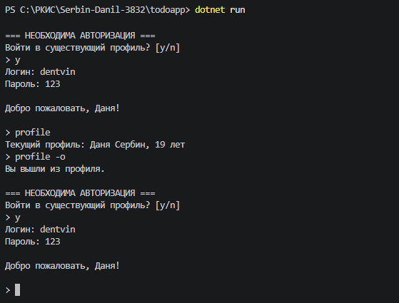

---

### TC-07 Добавление многострочных задач

**Описание:** Проверка добавления задачи с переносами строк.

**Предусловия:** Пользователь авторизован.

**Последовательность действий:**
1. Ввести команду `add -m`
2. Ввести строки:
   - `Строка 1`
   - `Строка 2`
   - `Строка 3`
   - `!end`

**Ожидаемый результат:**
- Задача создана с переносами строк
- При чтении отображается многострочный текст

**Скриншоты:**

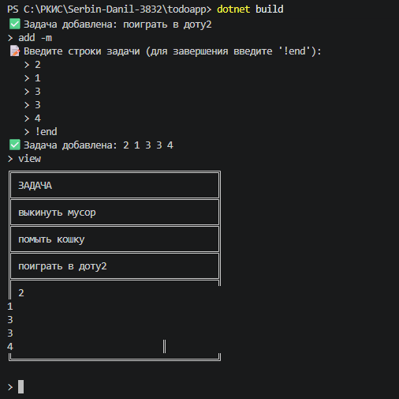

---

### TC-08 Добавление задачи со служебными символами

**Описание:** Проверка обработки символов: | ; , : \ /

**Предусловия:** Пользователь авторизован.

**Последовательность действий:**
1. Ввести команду `add "Купить: молоко; сыр|хлеб, масло"`

**Ожидаемый результат:**
- Задача создана корректно
- Символы сохраняются и отображаются правильно

**Скриншоты:**

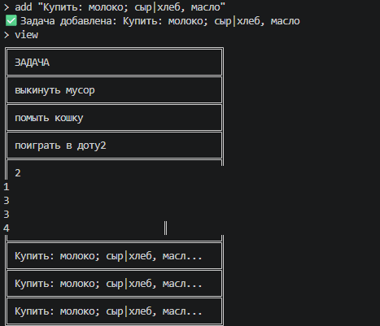

---

### TC-09 Проверка отображения добавленной задачи (read)

**Описание:** Проверка чтения полного текста задачи.

**Предусловия:** Создана задача с индексом 0.

**Последовательность действий:**
1. Ввести команду `read 0`

**Ожидаемый результат:**
- Отображается полный текст задачи
- Отображается статус и дата изменения

**Скриншоты:**

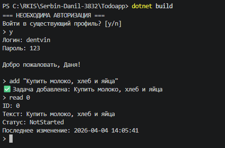

---

## 3. Просмотр задач (view)

### TC-10 Просмотр списка задач

**Описание:** Проверка базового просмотра задач.

**Предусловия:** Есть хотя бы 3 задачи.

**Последовательность действий:**
1. Ввести команду `view`

**Ожидаемый результат:**
- Отображается список задач
- Каждая задача на отдельной строке

**Скриншоты:**

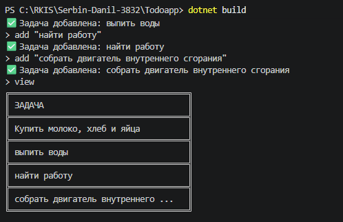

---

### TC-11 Корректное отображение при разных флагах

**Описание:** Проверка флагов view.

**Предусловия:** Есть задачи.

**Последовательность действий:**
1. `view -i` — показать индексы
2. `view -s` — показать статусы
3. `view -d` — показать даты
4. `view -a` — показать всё

**Ожидаемый результат:**
- Каждый флаг работает корректно
- Форматирование таблицы сохраняется

**Скриншоты:**

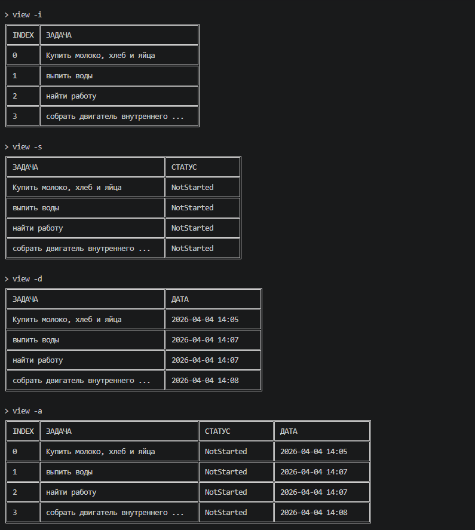

---

### TC-12 Просмотр задач при пустом списке

**Описание:** Проверка поведения при отсутствии задач.

**Предусловия:** Нет задач у текущего пользователя.

**Последовательность действий:**
1. Ввести `view`

**Ожидаемый результат:**
- Сообщение: `Список задач пуст`

**Скриншоты:**

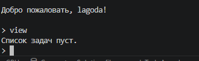

---

## 4. Обновление задач (update / status)

### TC-13 Обновление текста задачи

**Описание:** Проверка изменения текста задачи.

**Предусловия:** Есть задача с индексом 0.

**Последовательность действий:**
1. Ввести `update 0 "Новый текст задачи"`

**Ожидаемый результат:**
- Сообщение: `Задача обновлена`
- При `read 0` отображается новый текст

**Скриншоты:**

---

### TC-14 Обновление статуса задачи

**Описание:** Проверка изменения статуса.

**Предусловия:** Есть задача с индексом 0.

**Последовательность действий:**
1. Ввести `status 0 completed`

**Ожидаемый результат:**
- Сообщение: `Статус задачи изменён на: Completed`
- При `read 0` статус отображается как Completed

**Скриншоты:**

---

### TC-15 Попытка обновить несуществующую задачу

**Описание:** Проверка обработки неверного индекса.

**Предусловия:** Всего задач 3 (индексы 0-2).

**Последовательность действий:**
1. Ввести `update 99 "Новый текст"`

**Ожидаемый результат:**
- Сообщение: `[ОШИБКА ЗАДАЧИ] Задача с индексом 99 не найдена`

**Скриншоты:**

---

## 5. Удаление задач (delete)

### TC-16 Удаление существующей задачи

**Описание:** Проверка удаления задачи.

**Предусловия:** Есть задача с индексом 0.

**Последовательность действий:**
1. Ввести `delete 0`

**Ожидаемый результат:**
- Сообщение: `Задача удалена: текст задачи`

**Скриншоты:**

---

### TC-17 Попытка удалить несуществующую задачу

**Описание:** Проверка обработки неверного индекса.

**Последовательность действий:**
1. Ввести `delete 99`

**Ожидаемый результат:**
- Сообщение: `[ОШИБКА ЗАДАЧИ] Задача с индексом 99 не найдена`

**Скриншоты:**

---

## 6. Undo / Redo

### TC-18 Отмена последнего действия (undo)

**Описание:** Проверка отмены добавления задачи.

**Последовательность действий:**
1. `add "Тестовая задача"`
2. `undo`

**Ожидаемый результат:**
- Сообщение: `Отменено добавление задачи`
- Задача удалена из списка

**Скриншоты:**

---

### TC-19 Повтор отменённого действия (redo)

**Описание:** Проверка redo.

**Последовательность действий:**
1. `add "Тест"`
2. `undo`
3. `redo`

**Ожидаемый результат:**
- Задача снова добавлена

**Скриншоты:**

---

### TC-20 Undo при пустом стеке

**Описание:** Проверка обработки ошибки.

**Последовательность действий:**
1. Запустить программу (без действий)
2. `undo`

**Ожидаемый результат:**
- Сообщение: `[ОШИБКА UNDO/REDO] Невозможно выполнить операцию: стек 'Undo' пуст`

**Скриншоты:**

---

## 7. Дополнительные команды

### TC-21 Команда help

**Описание:** Проверка отображения справки.

**Последовательность действий:**
1. `help`

**Ожидаемый результат:**
- Отображается полный список команд

**Скриншоты:**

---

### TC-22 Команда linq

**Описание:** Проверка демонстрации LINQ.

**Последовательность действий:**
1. `linq`

**Ожидаемый результат:**
- Отображаются результаты LINQ операций

**Скриншоты:**

---

### TC-23 Команда error

**Описание:** Проверка демонстрации ошибок.

**Последовательность действий:**
1. `error`

**Ожидаемый результат:**
- Отображаются примеры обработки исключений

**Скриншоты:**

---

### TC-24 Команда load

**Описание:** Проверка параллельных загрузок.

**Последовательность действий:**
1. `load 3 100`

**Ожидаемый результат:**
- 3 прогресс-бара обновляются одновременно
- Все завершаются на 100%

**Скриншоты:**

---

### TC-25 Команда sync --push / --pull

**Описание:** Проверка синхронизации с сервером.

**Предусловия:** Сервер TodoApp.Server запущен.

**Последовательность действий:**
1. `sync --push`
2. `sync --pull`

**Ожидаемый результат:**
- Данные отправлены и загружены

**Скриншоты:**

---

## Результаты тестирования

| TC ID | Название | Статус | Дата |
|-------|----------|--------|------|
| TC-01 | Создание нового пользователя | ⬜ PENDING | - |
| TC-02 | Авторизация пользователя | ⬜ PENDING | - |
| TC-03 | Ошибка авторизации (неверный пароль) | ⬜ PENDING | - |
| TC-04 | Выход из текущего пользователя | ⬜ PENDING | - |
| TC-05 | Добавление задачи с корректными данными | ⬜ PENDING | - |
| TC-06 | Добавление задачи с пустым названием | ⬜ PENDING | - |
| TC-07 | Добавление многострочных задач | ⬜ PENDING | - |
| TC-08 | Добавление задачи со служебными символами | ⬜ PENDING | - |
| TC-09 | Проверка отображения добавленной задачи | ⬜ PENDING | - |
| TC-10 | Просмотр списка задач | ⬜ PENDING | - |
| TC-11 | Корректное отображение при разных флагах | ⬜ PENDING | - |
| TC-12 | Просмотр задач при пустом списке | ⬜ PENDING | - |
| TC-13 | Обновление текста задачи | ⬜ PENDING | - |
| TC-14 | Обновление статуса задачи | ⬜ PENDING | - |
| TC-15 | Попытка обновить несуществующую задачу | ⬜ PENDING | - |
| TC-16 | Удаление существующей задачи | ⬜ PENDING | - |
| TC-17 | Попытка удалить несуществующую задачу | ⬜ PENDING | - |
| TC-18 | Отмена последнего действия (undo) | ⬜ PENDING | - |
| TC-19 | Повтор отменённого действия (redo) | ⬜ PENDING | - |
| TC-20 | Undo при пустом стеке | ⬜ PENDING | - |
| TC-21 | Команда help | ⬜ PENDING | - |
| TC-22 | Команда linq | ⬜ PENDING | - |
| TC-23 | Команда error | ⬜ PENDING | - |
| TC-24 | Команда load | ⬜ PENDING | - |
| TC-25 | Команда sync | ⬜ PENDING | - |

---

## Заключение

Все тест-кейсы будут выполнены и отмечены статусом PASS после ручного тестирования.